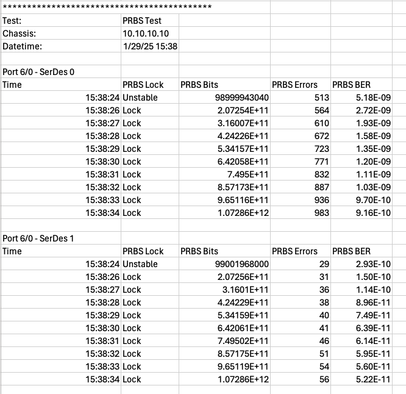

PRBS BER Test
===========================================

The PRBS BER Test collects the bit error rate data using PRBS pattern. The test is performed to ensure that the cable meets the required specifications.

Setup
-----

1. PRBS polynomial
2. Test duration

Method
----------

1. Enable PRBS pattern on TX ports.
2. Clear counters.
3. Measure **PRBS BER on each SerDex lane** of each RX ports.
4. Report the time-series data of the PRBS BER

Output Example
----------------

    PRBS BER Example