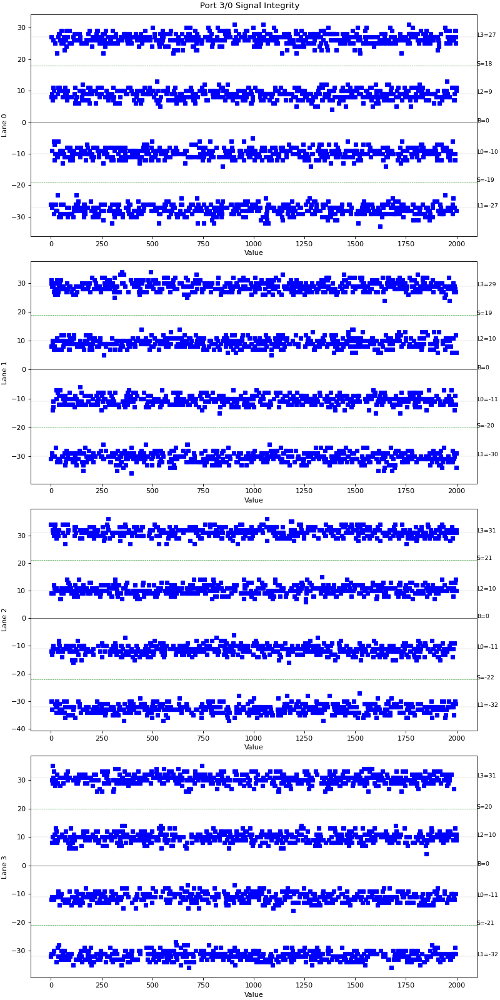
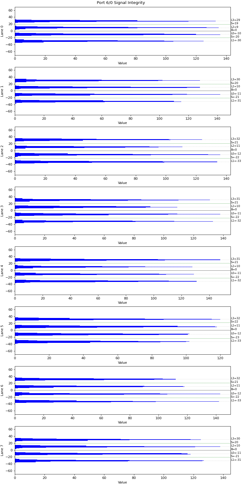

Signal Integrity Information
===========================================

The Signal Integrity collects the signal integrity data of each lane of the port. 

Setup
-----

Method
----------

1. Read the SIV data of each lane of the ports.
2. Save the SIV sample view of the ports.
3. Save the SIV histogram view of the ports.

Output Example
----------------

    SIV Plot Example (400G, 4 lanes)

    SIV Plot Example (800G, 8 lanes)