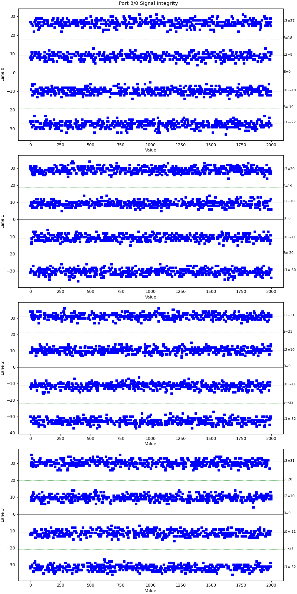

Signal Integrity Information
===========================================

The Signal Integrity collects the signal integrity data of each lane of the port. 

Setup
-----

Method
----------

1. Read the SIV data of each lane of the port.
2. Save the data in an image file.

Output Example
----------------

    SIV Plot Example