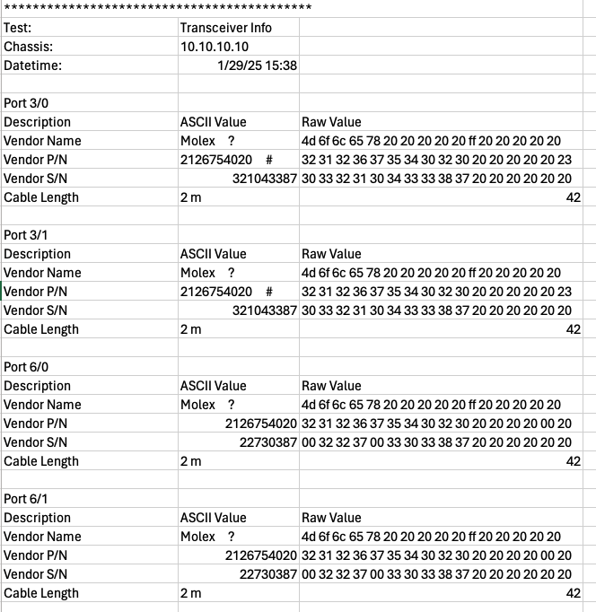

Transceiver Information
===========================================

The Transceiver Information collects the transceiver basic information.

Setup
-----

Method
----------

1. Read and save the transceiver basic information in ASCII and Hex, including:
    
    * Vendor Name
    * Part Number
    * Serial Number
    * Cable Length

Output Example
----------------

    Transceiver Information Example