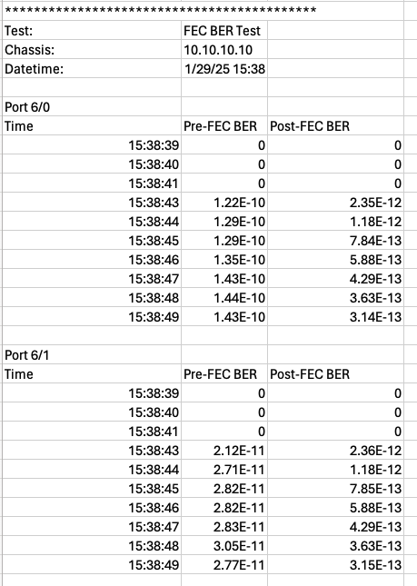

Pre-FEC and Post-FEC BER Measurement
===========================================

To further enhance the cable qualification process, performing both pre-FEC and post-FEC Bit Error Rate (BER) measurements is essential:

* **Pre-FEC BER Measurement**: This measures the bit error rate before any error correction is applied. It provides a raw assessment of the signal quality and the inherent error rate of the transmission.
* **Post-FEC BER Measurement**: This measures the bit error rate after forward error correction has been applied. It shows the effectiveness of the FEC in correcting errors and provides a more realistic view of the actual performance experienced by the end user.

By including both pre-FEC and post-FEC BER measurements, you can gain a comprehensive understanding of the cable's performance and the effectiveness of the error correction mechanisms.

Setup
-----

1. Test duration

Method
----------

1. Enable FEC on TX ports.
2. Clear FEC counters.
3. Measure **pre-FEC BER** and **post-FEC BER** on RX ports.
4. Report the time-series data of the pre-FEC BER and post-FEC BER.

Output Example
----------------

    FEC BER Example