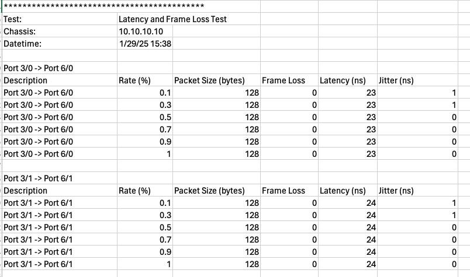

Latency and Frame Loss Testing
===========================================

To complete the cable qualification process, performing latency and frame loss tests, similar to those defined in RFC 2544, is essential. These tests provide a comprehensive evaluation of the cable's performance under various conditions.

Latency Testing
----------------

* **Definition**: Latency is the delay between a frame being sent and its reception on the other end of the measured link. It is crucial for applications requiring real-time communication, such as VoIP and video conferencing.
* **Measurement**: The latency test measures the time interval from when the last bit of the input frame reaches the input port to when the first bit of the output frame is seen on the output port1. This helps in assessing the delay introduced by the cable and any connected devices.
* **Importance**: Low and consistent latency is vital for maintaining high-quality communication and data transfer. High or variable latency can lead to performance issues and degraded user experience.

Frame Loss Testing
-------------------

* **Definition**: Frame loss occurs when data frames are not successfully transmitted from the sender to the receiver. This can happen due to network congestion, errors, or insufficient resources.
* **Measurement**: The frame loss test calculates the percentage of frames that should have been forwarded by a network device under steady-state conditions but were not due to lack of resources. This provides an indication of the cable's reliability and performance under load.
* **Importance**: Minimizing frame loss is critical for ensuring data integrity and maintaining the quality of service. High frame loss can lead to retransmissions, increased latency, and overall reduced network performance.

By incorporating these tests into your cable qualification methodology, you can ensure a thorough evaluation of the cable's performance, helping to identify any potential issues and optimize the system for reliable and efficient data transmission.

Setup
-----

1. Start traffic rate (percentage of line rate)
2. End traffic rate (percentage of line rate)
3. Step size (percentage of line rate)
4. Packet sizes
5. Test duration

Method
----------

1. Create an Ethernet stream with a packet size.
2. Start traffic with the start rate.
3. Measure **aggregated average latency**, **aggregated average jitter** and **frame loss**.
4. Increase traffic rate by step size.
5. Repeat steps 2-3 until the end rate is reached.
6. Repeat the above for each packet size.

Output Example
----------------

    Latency & Frame Loss Example