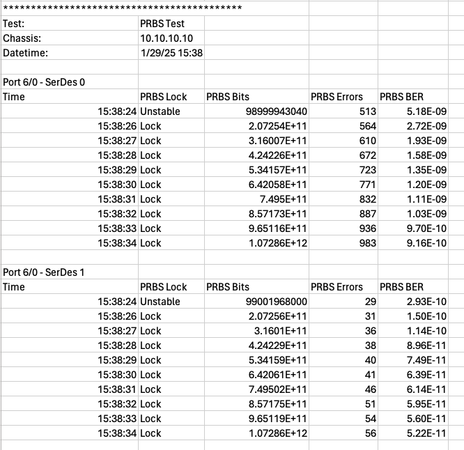

PRBS BER Testing
=================

Pseudo-Random Binary Sequence (PRBS) Bit Error Rate (BER) Testing is a critical component of the cable qualification process. Here's an overview of when and why you perform PRBS BER testing:

**When to Perform PRBS BER Testing:**

* **Initial Cable Qualification**: Conduct PRBS BER testing during the initial qualification of a new cable to establish a baseline performance metric.
* **After Loading Equalization Settings**: Perform the test after configuring the host side and module side TX equalization settings to evaluate their impact on signal integrity and error rates.
* **Routine Maintenance**: Regularly test cables in use to ensure they continue to meet performance standards and to detect any degradation over time.
* **Post-Installation**: After installing cables in a new setup, perform PRBS BER testing to verify that the installation has not introduced any issues.

**Why Perform PRBS BER Testing:**

* **Assess Signal Quality**: PRBS BER testing helps in assessing the raw signal quality by measuring the bit error rate without any error correction.
* **Identify Weaknesses**: It can identify weaknesses in the transmission path, such as signal loss, noise, and interference, which can affect overall performance.
* **Optimize Settings**: The results of PRBS BER testing can be used to fine-tune equalization settings and other parameters to optimize the cable's performance.
* **Ensure Reliability**: Regular testing ensures that cables maintain their reliability and performance over time, reducing the risk of data transmission errors.

By incorporating PRBS BER testing into your cable qualification methodology, you can ensure a thorough evaluation of the cable's performance and maintain high standards of signal integrity.

Impact of Different PRBS Polynomials on Equalization
----------------------------------------------------

When performing PRBS BER testing, the choice of PRBS polynomial can have a significant impact on the equalization settings. Here are some key considerations to keep in mind:

PRBS Patterns and Polynomials
^^^^^^^^^^^^^^^^^^^^^^^^^^^^^

* **PRBS-7 (2^7-1)**: This pattern is generated using a polynomial of degree 7. It has a relatively short sequence length and can be used to test basic signal integrity and equalization settings.
* **PRBS-15 (2^15-1)**: With a polynomial of degree 15, this pattern has a longer sequence length, providing a more rigorous test of the equalization settings.
* **PRBS-31 (2^31-1)**: This pattern uses a polynomial of degree 31, creating a very long sequence. It is particularly useful for stressing the equalization settings and identifying any weaknesses in the signal path.

Stressing Equalization Settings
^^^^^^^^^^^^^^^^^^^^^^^^^^^^^^^^

* **Shorter PRBS Patterns**: These patterns, such as PRBS-7, tend to stress the equalization settings less. They are useful for initial testing and basic validation of the signal path.
* **Longer PRBS Patterns**: Patterns like PRBS-15 and PRBS-31 provide a more comprehensive test by introducing a wider variety of bit sequences. This can help identify issues with signal integrity and the effectiveness of the equalization settings.
* **High-Frequency Components**: Different PRBS patterns contain varying levels of high-frequency components. Longer patterns typically have more high-frequency content, which can stress the equalization settings more and reveal potential issues with signal integrity.

By using a combination of different PRBS patterns, you can thoroughly test and optimize the equalization settings for your cable system. This approach ensures that the system can handle a wide range of signal conditions and maintain high performance

Setup
-----

1. PRBS polynomial
2. Test duration

Method
----------

1. Enable PRBS pattern on TX ports.
2. Clear counters.
3. Measure **PRBS BER on each SerDex lane** of each RX ports.
4. Report the time-series data of the PRBS BER

Output Example
----------------

    PRBS BER Example