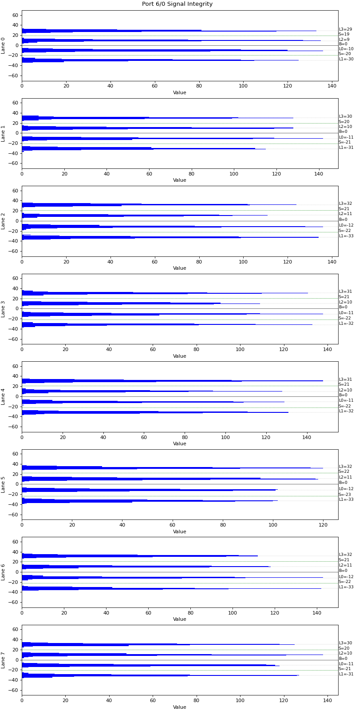

Saving Signal Integrity Diagrams
===========================================

It is also very important to save the signal integrity diagrams in the test report. These diagrams provide a visual representation of the signal quality and can be invaluable for:

* **Visual Analysis**: Quickly identifying any issues or anomalies in the signal.
* **Documentation**: Keeping a detailed record of the signal integrity for future reference and comparison.
* **Troubleshooting**: Helping to diagnose and resolve any signal-related problems by providing a clear visual reference.

By saving these diagrams, the test reports become more comprehensive and useful for ensuring the highest quality and performance of the cables.

1. Save the SIV sample view of the ports.
2. Save the SIV histogram view of the ports.

Output Example
----------------

.. figure:: images/siv_sample_image.png
    :alt: SIV Sample View Example
    :target: images/siv_sample_image.png

    SIV Plot Example (400G, 4 lanes)

    SIV Plot Example (800G, 8 lanes)