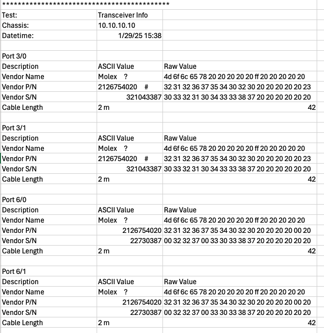

Module Information
===========================================

The Xena Cable Qualification Test Methodology includes a feature that reads and records detailed transceiver information. This information is crucial for comparing different cables and selecting the best one for your needs. The key transceiver details captured include:

* **Vendor Name**: Identifies the manufacturer of the transceiver, which can be important for ensuring compatibility and quality.
* **Part Number**: Provides the specific model of the transceiver, allowing for precise identification and comparison.
* **Serial Number**: A unique identifier for each transceiver, useful for tracking and inventory purposes.
* **Cable Length**: Measures the length of the cable, which can affect signal integrity and performance.

By capturing and documenting these details, users can easily compare test reports from different cables. This helps in making informed decisions based on the performance and specifications of each cable, ensuring the selection of the best option for their specific requirements.

Output Example
----------------

    Module Information Example